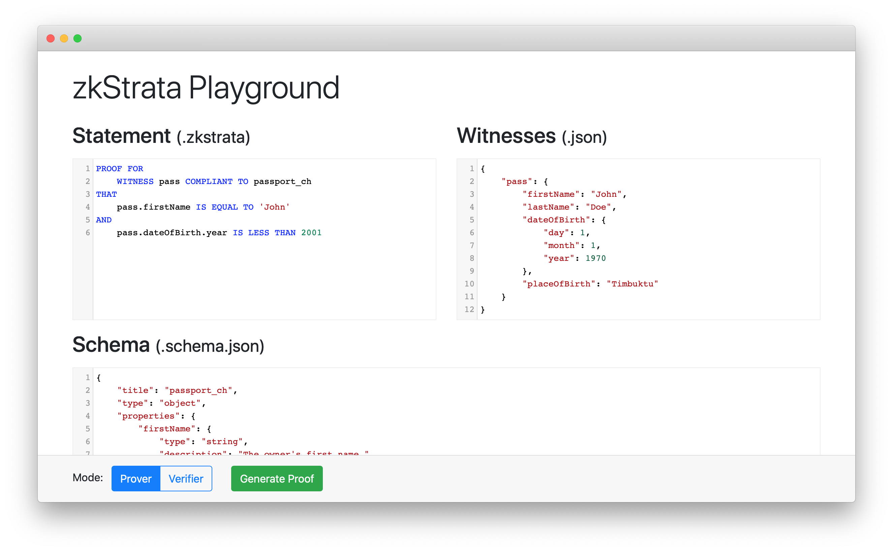

# zkStrata-playground
The zkStrata Playground is a tool to showcase [zkStrata](https://github.com/MarcKloter/zkStrata), a declarative language for zero-knowledge proof specification over structured data.



The playground can be launched using [Docker](https://www.docker.com/).

## Getting started
The container is deployed as [GitHub Package](https://github.com/MarcKloter/zkStrata-playground/packages/111216) (see package description).

Alternatively the container can be built manually using this repository:

1. Cloning this repository and its submodules:
   ```
   git clone https://github.com/MarcKloter/zkStrata-playground.git
   cd zkStrata-playground
   git submodule init
   git submodule update
   ```

2. Compiling the multi-stage build:
   ```
   docker image build -f playground.dockerfile -t playground .
   ```

3. Running the container:
   ```
   docker container run --publish 8000:3000 --detach --name pg playground
   ```

4. The playground will be available at http://localhost:8000/.
